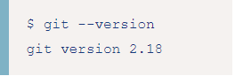

# ___Как узнать, что Git установлен?___

Чтобы узнать установлен ли Git на компьютере, а так же его версию, необходимо выполнить несколько действий.

## на Linux:

Чтобы узнать, установленную версию Git, необходимо выполнить команду:

```bash=
$ git --version
```
  
  или просто: 
  
```bash=
  $ git version
```

 Результат выполнения команды будет примерно следующий:

 

 Для установки выполните в терминале команду:

```bash=
$ sudo apt install git
```

[< на главную](./readme.md)