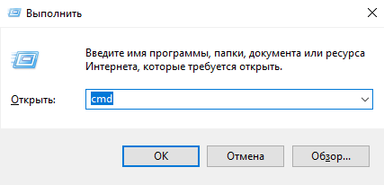
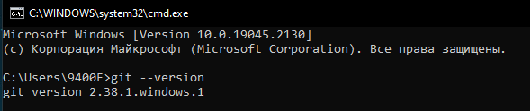

# ___Как узнать, что Git установлен?___

Чтобы узнать установлен ли Git на компьютере, а так же его версию, необходимо выполнить несколько действий.

## на Windows:

Для этого вызываем командную строку, с помощью сочетания клавиш win+R и команды cmd вызываем командную строку.

в которой вводим команду __>git --version__

Так мы узнаем, что у нас установлен Git версии **2.38.1.windows.1**

Если же требуется установка перейдите по [ссылке](https://git-scm.com/download/win) и следуйте дальнейшим инструкциям.

[< на главную](./readme.md)